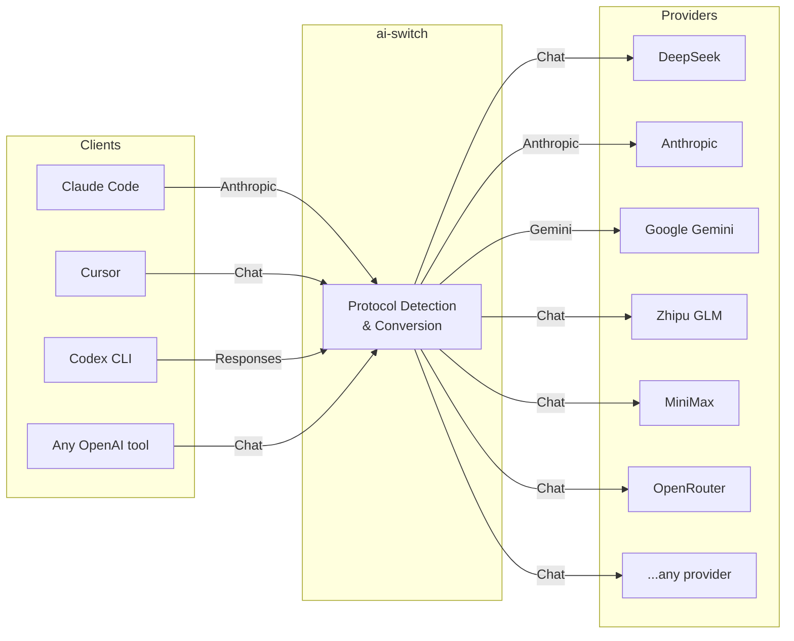

# ai-switch

[](https://goreportcard.com/report/github.com/keepmind9/ai-switch) [](https://opensource.org/licenses/MIT) [](https://github.com/keepmind9/ai-switch/releases)

**Local LLM proxy — let Claude Code, Cursor, Codex CLI use any AI provider.**

**One binary. One config. Any AI CLI → any LLM API.**

**Linux / macOS:**
```bash
curl -sL https://raw.githubusercontent.com/keepmind9/ai-switch/main/scripts/install.sh | bash
```

**Windows (PowerShell):**
```powershell
irm https://raw.githubusercontent.com/keepmind9/ai-switch/main/scripts/install.ps1 | iex
```

[Quick Start](#quick-start) · [Features](#features) · [Supported Providers & Clients](#supported-providers--clients) · [Configuration](#configuration) · [CLI](#cli) · [Admin UI](#admin-ui) · [FAQ](#faq)

**English** | [中文](README_zh.md)

---

## Quick Start

```bash
# 1. Install (Linux / macOS)
curl -sL https://raw.githubusercontent.com/keepmind9/ai-switch/main/scripts/install.sh | bash

# Or Windows (PowerShell):
# irm https://raw.githubusercontent.com/keepmind9/ai-switch/main/scripts/install.ps1 | iex

# 2. Start
ais serve

# 3. Point your AI tool
export ANTHROPIC_BASE_URL=http://localhost:12345
export ANTHROPIC_API_KEY=ais-default
```

That's it — Claude Code is now using your configured LLM provider.

> No config file needed — `ais serve` auto-creates `~/.ai-switch/config.yaml` on first run.
> Open `http://localhost:12345/ui` in your browser to configure providers via the Admin UI.

<details>
<summary>Build from source</summary>

```bash
git clone https://github.com/keepmind9/ai-switch.git
cd ai-switch
make build-all   # build frontend + Go binary (includes Admin UI)
# or: make build  # Go only, no Admin UI
```

</details>

<details>
<summary>Configure other AI tools</summary>

**Codex CLI:**

```toml
[model_providers.proxy]
name = "ai-switch"
base_url = "http://localhost:12345/v1"
api_key = "ais-default"
wire_api = "responses"
```

Codex CLI's remote compaction (`/compact`) works on any upstream automatically — see [Codex Compaction](docs/codex-compaction.md).

**Cursor / Any OpenAI-compatible tool:**

```bash
export OPENAI_BASE_URL=http://localhost:12345/v1
export OPENAI_API_KEY=ais-default
```

**Or use the agent launcher (zero config):**

```bash
ais agent my-route-key claude    # Launch Claude Code
ais agent my-route-key codex     # Launch Codex CLI
```

</details>

---

## How It Works



ai-switch sits between your AI tools and upstream LLM providers. It auto-detects the client protocol and converts transparently — your tools think they're talking to OpenAI/Anthropic directly.

---

## Supported Providers & Clients

### Clients

| Client | Protocol | Config |
|--------|----------|--------|
| Claude Code | Anthropic | `ANTHROPIC_BASE_URL` |
| Cursor | OpenAI Chat | `OPENAI_BASE_URL` |
| Codex CLI | Responses API | toml config |
| ChatGPT-Next-Web | OpenAI Chat | Settings UI |
| Any OpenAI-compatible tool | Chat / Responses | `OPENAI_BASE_URL` |

### Upstream Providers

Any OpenAI-compatible API works out of the box. Verified with:

DeepSeek · OpenAI · Anthropic · Google Gemini · Zhipu GLM · MiniMax · SiliconFlow · OpenRouter · Moonshot · Qwen (Alibaba) · StepFun · Doubao (ByteDance)

### Protocol Conversion

All 4 protocols are cross-convertible — any client can talk to any provider:

| | → Chat | → Anthropic | → Responses | → Gemini |
|---|:---:|:---:|:---:|:---:|
| **Chat** → | ✅ | ✅ | ✅ | ✅ |
| **Anthropic** → | ✅ | ✅ | ✅ | ✅ |
| **Responses** → | ✅ | ✅ | ✅ | ✅ |

---

## Features

**🔄 Multi-Protocol Conversion**
Auto-detect client protocol (Chat / Anthropic / Responses / Gemini) and convert to any upstream format — all 4 protocols, N×N cross-conversion.

**🎯 Smart Routing**
Route requests to different models based on what the AI tool is doing — thinking tasks → DeepSeek, web search → Zhipu, background → lightweight model. Supports scene detection, model name mapping, and cross-provider routing.

**🛡️ Reliability**
Multi-key fallback on 429/529 rate limiting, hot config reload without restart, automatic config backup with one-click restore and corrupt-file auto-recovery.

**📊 Observability**
Built-in Admin UI with provider/route management, per-request tracing (raw viewer, diff view, TTFB waterfall), and token usage statistics with trend charts.

**🪶 Lightweight**
Pure Go, single binary, zero dependencies. No Python, no Docker, no runtime. Download and run.

---

## Configuration

### Minimal Config

```yaml
providers:
  deepseek:
    name: "DeepSeek"
    base_url: "https://api.deepseek.com/v1"
    api_key: "${DEEPSEEK_API_KEY}"    # supports ${ENV_VAR} expansion
    format: "chat"                     # chat | responses | anthropic | gemini

routes:
  "ais-default":
    provider: "deepseek"
    default_model: "deepseek-chat"
```

### Full Provider Options

```yaml
providers:
  deepseek:
    name: "DeepSeek"
    base_url: "https://api.deepseek.com/v1"
    api_key: "${DEEPSEEK_API_KEY}"
    format: "chat"
    think_tag: "think"                 # optional: strip reasoning tags
    fallback_keys:                     # optional: backup keys for 429 fallback
      - "${DEEPSEEK_API_KEY_2}"
    models:                            # optional: for GET /v1/models & validation
      - "deepseek-chat"
      - "deepseek-reasoner"
    enable_proxy: true                 # optional: use global proxy_url
    custom_headers:                    # optional: override forwarded client headers (e.g. User-Agent for UA-gated upstreams like Kimi Coding Plan)
      User-Agent: "claude-code/1.0.0"
```

### Google Gemini

```yaml
providers:
  google:
    name: "Google Gemini"
    base_url: "https://generativelanguage.googleapis.com"
    api_key: "${GOOGLE_API_KEY}"
    format: "gemini"
```

No `path` needed — ai-switch auto-builds `/v1beta/models/{model}:generateContent`.

<details>
<summary><strong>Scene Map — route by request type</strong></summary>

Route Claude Code requests to different models based on what it's doing:

```yaml
routes:
  "ais-claude":
    provider: "zhipu"
    default_model: "glm-5.1"
    long_context_threshold: 60000
    scene_map:
      default: "glm-5.1"
      think: "glm-5.1"
      websearch: "glm-4.7"
      background: "glm-4.5-air"
      longContext: "glm-5.1"
```

| Scene | Key | Detection |
|-------|-----|-----------|
| Long Context | `longContext` | Token count exceeds `long_context_threshold` |
| Background | `background` | Model name contains "haiku" |
| Web Search | `websearch` | Tools contain `web_search_*` type |
| Thinking | `think` | `thinking` field present |
| Image | `image` | User messages contain image blocks |
| Default | `default` | Fallback |

Priority: `longContext` > `background` > `websearch` > `think` > `image` > `default`

</details>

<details>
<summary><strong>Model Map — map client model names</strong></summary>

```yaml
routes:
  "ais-default":
    provider: "deepseek"
    default_model: "deepseek-chat"
    model_map:
      "claude-sonnet-4-5": "deepseek-chat"
      "gpt-4o": "deepseek-chat"
```

</details>

<details>
<summary><strong>Cross-Provider Routing</strong></summary>

Use `provider|model` to route to a different provider within the same route:

```yaml
routes:
  "ais-default":
    provider: "minimax"
    default_model: "MiniMax-M2.5"
    scene_map:
      default: "MiniMax-M2.5"
      think: "deepseek|deepseek-chat"
      websearch: "zhipu|glm-4.7"
```

</details>

<details>
<summary><strong>Default Routes — fallback routing</strong></summary>

```yaml
default_route: "ais-default"              # global fallback
default_anthropic_route: "ais-zhipu"      # /v1/messages (Claude Code)
default_responses_route: "ais-default"    # /v1/responses (Codex CLI)
default_chat_route: "ais-default"         # /v1/chat/completions
```

**Routing priority:** route key match > protocol-specific default > global `default_route`

</details>

<details>
<summary><strong>IP Whitelist & Upstream Proxy</strong></summary>

**IP Whitelist** (for non-localhost binding):

```yaml
server:
  host: "0.0.0.0"
  port: 12345
  allowed_ips:
    - "192.168.1.0/24"
    - "10.0.0.5"
```

**Upstream Proxy** (HTTP/SOCKS5):

```yaml
server:
  proxy_url: "socks5://127.0.0.1:1080"

providers:
  openai:
    enable_proxy: true
```

</details>

### Model Resolution Priority

1. **ModelMap** — exact model name match (case-insensitive)
2. **SceneMap** — scene detection (Anthropic protocol only)
3. **DefaultModel** — fallback

---

## CLI

```bash
ais serve                   # Start in foreground
ais serve -d                # Start as background daemon
ais serve -c config.yaml    # Start with custom config
ais stop                    # Stop the background daemon
ais check -c config.yaml    # Validate config without starting
ais version                 # Print version info
ais update                  # Check for updates
ais update --apply          # Apply the downloaded update
ais shortcut                # Create desktop shortcuts
ais agent <key> claude      # Launch Claude Code via ais
ais agent <key> codex       # Launch Codex CLI via ais
ais admin                   # Interactive admin REPL
ais admin provider list     # List providers
ais admin route list        # List routes
```

Running without a subcommand defaults to `serve`:

```bash
ais -c config.yaml          # Same as: ais serve -c config.yaml
```

### Agent Launcher

Launch AI agents with environment variables auto-configured:

```bash
ais agent my-route-key claude --continue
ais agent my-route-key codex --model o4-mini
```

Auto-configures environment and overrides agent settings — no manual setup needed.

### Admin CLI

Manage providers, routes, settings, and system from the terminal (no browser needed):

```bash
# Single-command mode
ais admin provider list                         # List all providers
ais admin provider add --key openai --name OpenAI --base-url https://api.openai.com --api-key sk-xxx
ais admin route list                            # List all routes
ais admin route enable mykey                    # Enable a route
ais admin route disable mykey                   # Disable a route
ais admin route default list                    # Show default routes
ais admin route default set --anthropic claude  # Set Anthropic default route
ais admin route default remove --anthropic      # Clear Anthropic default route
ais admin settings get                          # Show current settings
ais admin settings update --port 8080           # Update settings
ais admin status                                # Show server status

# Interactive REPL mode
ais admin
ais> provider list
ais> route default list
ais> help
ais> exit
```

All commands support `--url http://remote:12345` for remote server management and `-o json` for JSON output.

### Config Validation

```bash
$ ais check -c config.yaml

Checking config.yaml ...

  Providers: 3
  Routes:    3
  Default:   ais-default

✓ Config is valid.
```

---

## Admin UI

Open `http://localhost:12345/ui` for the built-in dashboard:

**Provider & Route Management**


Adding a provider auto-creates a same-named route — one step setup.

**Trace Viewer**

Full request/response tracing with raw viewer, diff comparison, and TTFB waterfall:

Trace logging is on by default (`llm_log_enabled: true`). Set it to `false` to stop writing trace files and save disk space.


**Usage Statistics**

Token usage by provider/model with daily trend charts:


---

## FAQ

**Does it support streaming?**

Yes — full SSE streaming with protocol conversion. Stream from Anthropic → Chat, Gemini → Responses, any combination.

**Can I use it with Cursor / Copilot / ChatGPT-Next-Web?**

Yes — any tool that supports OpenAI-compatible API. Just set `OPENAI_BASE_URL=http://localhost:12345/v1`.

**What if my provider isn't listed?**

Any OpenAI-compatible API works out of the box. Just add it as a provider with `format: "chat"`.

**How does it handle rate limiting?**

Configure `fallback_keys` on your provider — ai-switch automatically switches to the next key on 429/529.

**Can different scenes use different providers?**

Yes — use `scene_map` with `provider|model` syntax to route thinking → DeepSeek, web search → Zhipu, etc.

---

## Build

```bash
make build      # fmt + vet + compile
make build-all  # build frontend + Go binary
make install    # build all + install to ~/.local/bin
make test       # run tests
make clean      # remove binary
```

## License

[MIT](LICENSE)
