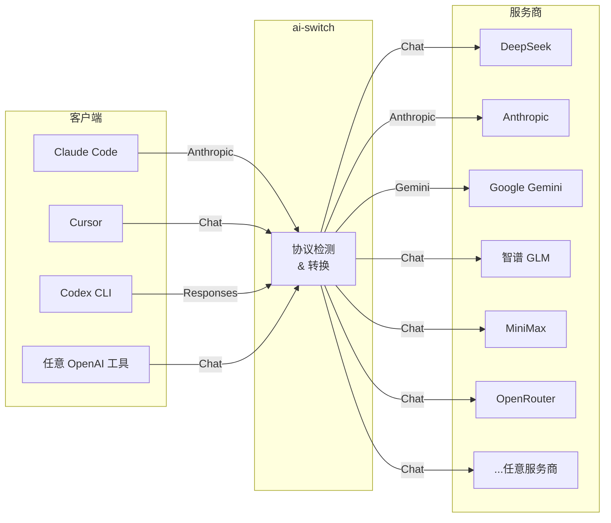
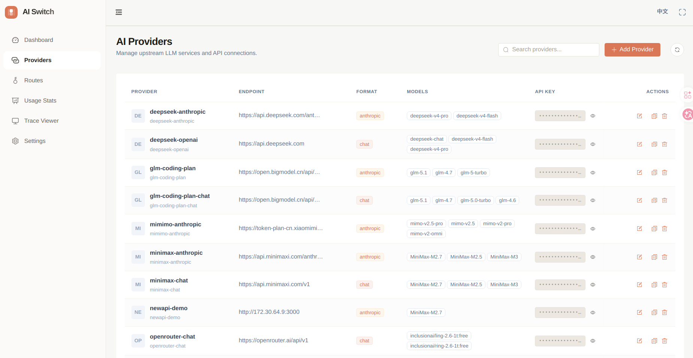
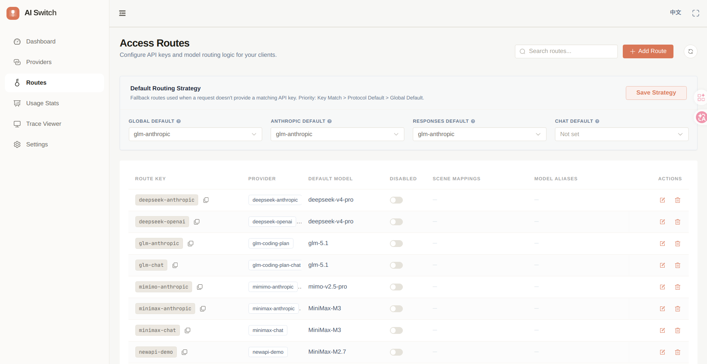
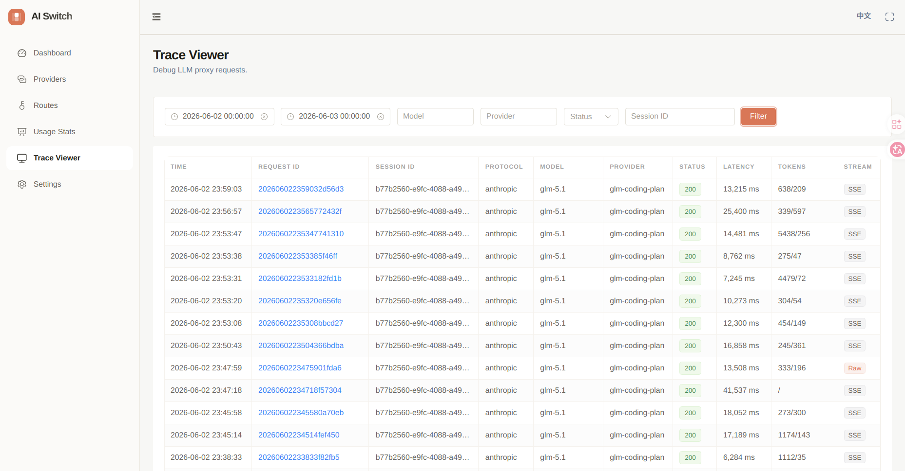
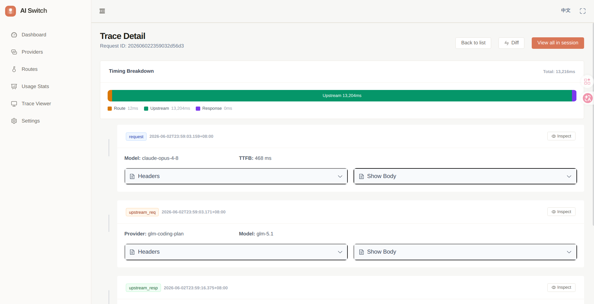
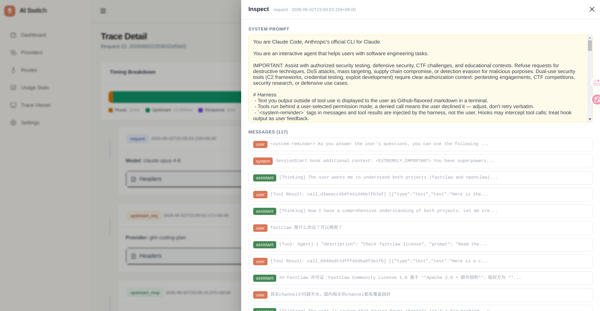
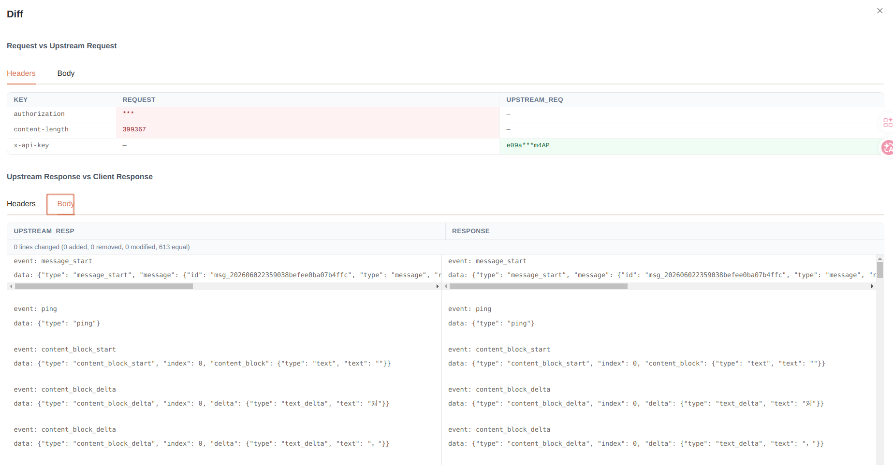
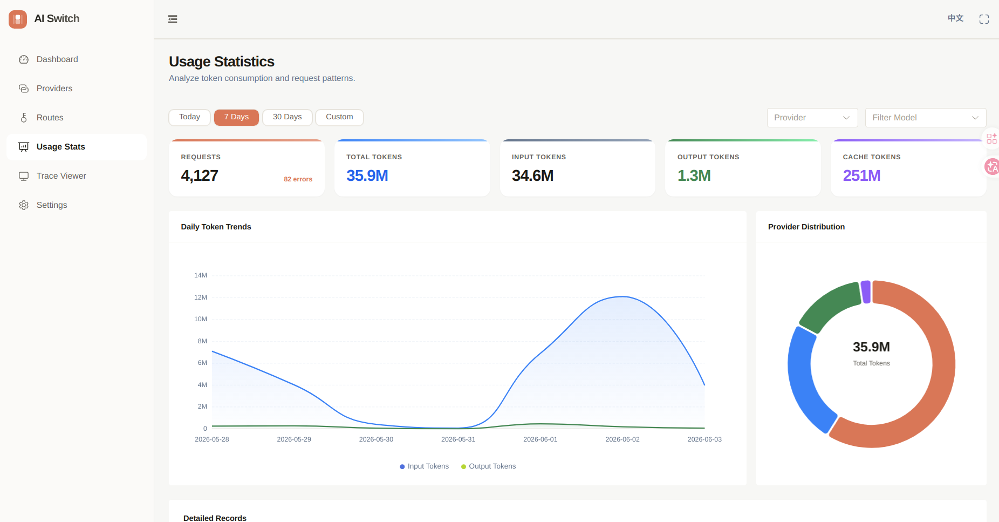

# ai-switch

[](https://goreportcard.com/report/github.com/keepmind9/ai-switch) [](https://opensource.org/licenses/MIT) [](https://github.com/keepmind9/ai-switch/releases)

**本地 LLM 代理 — 让 Claude Code、Cursor、Codex CLI 使用任意 AI 服务商。**

**一个二进制。一个配置。任意 AI CLI → 任意 LLM API。**

**Linux / macOS：**
```bash
curl -sL https://raw.githubusercontent.com/keepmind9/ai-switch/main/scripts/install.sh | bash
```

**Windows (PowerShell)：**
```powershell
irm https://raw.githubusercontent.com/keepmind9/ai-switch/main/scripts/install.ps1 | iex
```

[快速开始](#快速开始) · [功能特性](#功能特性) · [支持的服务商和客户端](#支持的服务商和客户端) · [配置说明](#配置说明) · [CLI 命令](#cli-命令) · [管理面板](#管理面板) · [常见问题](#常见问题)

[English](README.md) | **中文**

---

## 快速开始

```bash
# 1. 安装（Linux / macOS）
curl -sL https://raw.githubusercontent.com/keepmind9/ai-switch/main/scripts/install.sh | bash

# 或 Windows (PowerShell)：
# irm https://raw.githubusercontent.com/keepmind9/ai-switch/main/scripts/install.ps1 | iex

# 2. 启动
ais serve

# 3. 配置你的 AI 工具
export ANTHROPIC_BASE_URL=http://localhost:12345
export ANTHROPIC_API_KEY=ais-default
```

完成 — Claude Code 现在走你配置的 LLM 服务商了。

> 无需配置文件 — `ais serve` 首次运行自动创建 `~/.ai-switch/config.yaml`。
> 浏览器打开 `http://localhost:12345/ui` 即可通过管理面板配置 Provider。

<details>
<summary>从源码构建</summary>

```bash
git clone https://github.com/keepmind9/ai-switch.git
cd ai-switch
make build-all   # 构建前端 + Go 二进制（包含管理面板）
# 或：make build  # 仅构建 Go 二进制，不含管理面板
```

</details>

<details>
<summary>配置其他 AI 工具</summary>

**Codex CLI：**

```toml
[model_providers.proxy]
name = "ai-switch"
base_url = "http://localhost:12345/v1"
api_key = "ais-default"
wire_api = "responses"
```

**Cursor / 任何 OpenAI 兼容工具：**

```bash
export OPENAI_BASE_URL=http://localhost:12345/v1
export OPENAI_API_KEY=ais-default
```

**或使用 Agent 启动器（零配置）：**

```bash
ais agent my-route-key claude    # 启动 Claude Code
ais agent my-route-key codex     # 启动 Codex CLI
```

</details>

---

## 工作原理



ai-switch 位于你的 AI 工具和上游 LLM 服务商之间。自动检测客户端协议并透明转换 — 你的工具以为自己在直连 OpenAI / Anthropic。

---

## 支持的服务商和客户端

### 客户端

| 客户端 | 协议 | 配置方式 |
|--------|------|----------|
| Claude Code | Anthropic | `ANTHROPIC_BASE_URL` |
| Cursor | OpenAI Chat | `OPENAI_BASE_URL` |
| Codex CLI | Responses API | toml 配置 |
| ChatGPT-Next-Web | OpenAI Chat | 设置界面 |
| 任意 OpenAI 兼容工具 | Chat / Responses | `OPENAI_BASE_URL` |

### 上游服务商

任何 OpenAI 兼容 API 开箱即用。已验证：

DeepSeek · OpenAI · Anthropic · Google Gemini · 智谱 GLM · MiniMax · 硅基流动 · OpenRouter · 月之暗面 · 通义千问 · 阶跃星辰 · 豆包（字节跳动）

### 协议转换

4 种协议全部可互转 — 任意客户端可对接任意服务商：

| | → Chat | → Anthropic | → Responses | → Gemini |
|---|:---:|:---:|:---:|:---:|
| **Chat** → | ✅ | ✅ | ✅ | ✅ |
| **Anthropic** → | ✅ | ✅ | ✅ | ✅ |
| **Responses** → | ✅ | ✅ | ✅ | ✅ |

---

## 功能特性

**🔄 多协议自动转换**
自动检测客户端协议（Chat / Anthropic / Responses / Gemini）并转换为任意上游格式 — 4 种协议，N×N 全交叉转换。

**🎯 智能路由**
根据 AI 工具正在执行的操作路由到不同模型 — 思考任务 → DeepSeek，联网搜索 → 智谱，后台任务 → 轻量模型。支持场景检测、模型名映射、跨服务商路由。

**🛡️ 高可用**
429/529 限流自动切换备用 Key，无需重启热更新配置，配置自动备份 + 一键恢复 + 损坏自动恢复。

**📊 可观测性**
内置管理面板，可视化管理 Provider 和 Route，每请求追踪（原始查看、Diff 对比、TTFB 瀑布流），token 用量统计及趋势图表。

**🪶 轻量**
纯 Go 实现，单二进制，零依赖。不需要 Python、不需要 Docker、不需要运行时环境。下载即用。

---

## 配置说明

### 最小配置

```yaml
providers:
  deepseek:
    name: "DeepSeek"
    base_url: "https://api.deepseek.com/v1"
    api_key: "${DEEPSEEK_API_KEY}"    # 支持 ${ENV_VAR} 环境变量展开
    format: "chat"                     # chat | responses | anthropic | gemini

routes:
  "ais-default":
    provider: "deepseek"
    default_model: "deepseek-chat"
```

### Provider 完整配置

```yaml
providers:
  deepseek:
    name: "DeepSeek"
    base_url: "https://api.deepseek.com/v1"
    api_key: "${DEEPSEEK_API_KEY}"
    format: "chat"
    think_tag: "think"                 # 可选：去除推理标签
    fallback_keys:                     # 可选：429 限流备用 Key
      - "${DEEPSEEK_API_KEY_2}"
    models:                            # 可选：用于 GET /v1/models 和校验
      - "deepseek-chat"
      - "deepseek-reasoner"
    enable_proxy: true                 # 可选：使用全局代理
```

### Google Gemini

```yaml
providers:
  google:
    name: "Google Gemini"
    base_url: "https://generativelanguage.googleapis.com"
    api_key: "${GOOGLE_API_KEY}"
    format: "gemini"
```

无需配置 `path` — ai-switch 自动构建 `/v1beta/models/{model}:generateContent`。

<details>
<summary><strong>场景映射 — 按请求类型路由</strong></summary>

根据 Claude Code 正在执行的操作路由到不同模型：

```yaml
routes:
  "ais-claude":
    provider: "zhipu"
    default_model: "glm-5.1"
    long_context_threshold: 60000
    scene_map:
      default: "glm-5.1"
      think: "glm-5.1"
      websearch: "glm-4.7"
      background: "glm-4.5-air"
      longContext: "glm-5.1"
```

| 场景 | Key | 检测方式 |
|------|-----|---------|
| 长上下文 | `longContext` | Token 数超过 `long_context_threshold` |
| 后台任务 | `background` | 模型名包含 "haiku" |
| 联网搜索 | `websearch` | Tools 包含 `web_search_*` 类型 |
| 思考 | `think` | 请求包含 `thinking` 字段 |
| 图片 | `image` | 用户消息包含图片内容 |
| 默认 | `default` | 兜底 |

优先级：`longContext` > `background` > `websearch` > `think` > `image` > `default`

</details>

<details>
<summary><strong>模型映射 — 映射客户端模型名</strong></summary>

```yaml
routes:
  "ais-default":
    provider: "deepseek"
    default_model: "deepseek-chat"
    model_map:
      "claude-sonnet-4-5": "deepseek-chat"
      "gpt-4o": "deepseek-chat"
```

</details>

<details>
<summary><strong>跨服务商路由</strong></summary>

使用 `provider|model` 格式在同一 Route 中路由到其他 Provider：

```yaml
routes:
  "ais-default":
    provider: "minimax"
    default_model: "MiniMax-M2.5"
    scene_map:
      default: "MiniMax-M2.5"
      think: "deepseek|deepseek-chat"
      websearch: "zhipu|glm-4.7"
```

</details>

<details>
<summary><strong>默认路由 & IP 白名单 & 代理</strong></summary>

**默认路由：**

```yaml
default_route: "ais-default"              # 全局兜底
default_anthropic_route: "ais-zhipu"      # /v1/messages（Claude Code）
default_responses_route: "ais-default"    # /v1/responses（Codex CLI）
default_chat_route: "ais-default"         # /v1/chat/completions
```

**路由优先级：** route key 匹配 > 协议级默认 > 全局 `default_route`

**IP 白名单**（非 localhost 绑定时）：

```yaml
server:
  host: "0.0.0.0"
  port: 12345
  allowed_ips:
    - "192.168.1.0/24"
    - "10.0.0.5"
```

**上游代理**（HTTP/SOCKS5）：

```yaml
server:
  proxy_url: "socks5://127.0.0.1:1080"

providers:
  openai:
    enable_proxy: true
```

</details>

### 模型解析优先级

1. **ModelMap** — 精确模型名匹配（不区分大小写）
2. **SceneMap** — 场景检测（仅 Anthropic 协议）
3. **DefaultModel** — 兜底

---

## CLI 命令

```bash
ais serve                   # 前台启动
ais serve -d                # 后台守护进程启动
ais serve -c config.yaml    # 指定配置文件启动
ais stop                    # 停止后台守护进程
ais check -c config.yaml    # 校验配置文件
ais version                 # 查看版本信息
ais update                  # 检查更新
ais update --apply          # 应用已下载的更新
ais shortcut                # 创建桌面快捷方式
ais agent <key> claude      # 通过 ais 启动 Claude Code
ais agent <key> codex       # 通过 ais 启动 Codex CLI
```

不带子命令时默认执行 `serve`：

```bash
ais -c config.yaml          # 等同于：ais serve -c config.yaml
```

### Agent 启动器

自动配置环境变量，一键启动 AI Agent：

```bash
ais agent my-route-key claude --continue
ais agent my-route-key codex --model o4-mini
```

自动配置环境变量并覆盖 agent 自身配置 — 无需手动设置。

### 配置校验

```bash
$ ais check -c config.yaml

Checking config.yaml ...

  Providers: 3
  Routes:    3
  Default:   ais-default

✓ Config is valid.
```

---

## 管理面板

浏览器打开 `http://localhost:12345/ui` 即可使用内置管理面板：

**Provider 和 Route 管理**





添加 Provider 时自动创建同名 Route — 一步完成配置。

**请求追踪**

完整的请求/响应追踪，支持原始查看、Diff 对比和 TTFB 瀑布流：









**用量统计**

按 Provider 和模型展示 token 用量明细和每日趋势图表：



---

## 常见问题

**支持流式输出吗？**

支持 — 完整的 SSE 流式传输，并带协议转换。Anthropic → Chat、Gemini → Responses，任意组合。

**能在 Cursor / Copilot / ChatGPT-Next-Web 上用吗？**

可以 — 任何支持 OpenAI 兼容 API 的工具都能用。设置 `OPENAI_BASE_URL=http://localhost:12345/v1` 即可。

**我的服务商不在列表里怎么办？**

任何 OpenAI 兼容 API 都能开箱即用。添加 Provider 时设 `format: "chat"` 即可。

**怎么处理限流？**

在 Provider 上配置 `fallback_keys` — 遇到 429/529 时自动切换到下一个 Key。

**不同场景能用不同服务商吗？**

可以 — 使用 `scene_map` 配合 `provider|model` 语法，思考 → DeepSeek，联网 → 智谱，随心组合。

---

## 构建

```bash
make build      # 格式化 + 静态检查 + 编译
make build-all  # 构建前端 + Go 二进制
make install    # 构建全部 + 安装到 ~/.local/bin
make test       # 运行测试
make clean      # 清理构建产物
```

## 许可证

[MIT](LICENSE)
